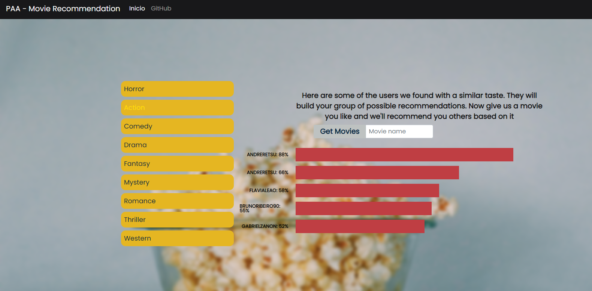

# Movie Recommendation

**Conteúdo da Disciplina**: Final<br>

## Alunos
|Matrícula | Aluno |
| -- | -- |
|17/0017885  |  Marcos Nery Borges Júnior |

## Sobre 
Esse projeto tem como finalidade te ajudar a decidir um bom filme para assistir. Para isso ele se 
utiliza da sua ordem de preferência em relação a possíveis gêneros e então te coloca em um grupo de usuários
com gostos semelhantes.
Com isso feito, é montado um grafo relacionando os cinco filmes favoritos de cada um dos usuários no seu grupo e seus respectivos gêneros. Nesse grafo é inserido um outro filme de sua escolha, que servirá de referência para as recomendações.
Por fim, é montada uma lista de sugestões ordenada pelos filmes que possuem mais relações significativas com o seu. Isso é feito calculando o número de menores caminhos de outros filmes até ele.

## Screenshots



## Instalação 
**Linguagem**: Python<br>
**Framework**: [Flask](https://flask.palletsprojects.com/en/1.1.x/installation/)<br>

Para utilizar o projeto você não precisa instala-lo. Este repositório tem um deploy no Heroku e você pode acessa-lo através da URL abaixo.

https://paa-movierecommendation.herokuapp.com/

Mas, se preferir ver o projeto funcionando localmente, para instalar basta seguir uma das alternativas a seguir:

* Docker: Se você tiver o docker instalado na sua máquina basta executar um ```docker-compose up``` e acessar o seu [localhost na porta 5000](http://localhost:5000/).
* Instalação manual: Para instalar tudo manualmente, basta executar um ```pip install -r requirements.txt``` e em seguida um  ```python web/app.py```, ambos na raiz do repositório. Feito isso a aplicação estará funcionando no localhost na porta indicada no terminal.

## Uso 
#### Fluxo principal
* Passo 1: Para usar o projeto basta ordenar a lista de gêneros de filme em acordo com sua preferência e então clicar no botão "Get Recommendations". 
* Passo 2: Inserir na caixa de texto o nome de um filme que você quer que seja usado como base para as recomendações
* Passo 3: Se desejar, você pode clicar no botão "View Graphs" para ter a visualização dos grafos que foram gerados para o seu grupo.
* Passo 4: Nessa tela, você pode alternar entre os layouts normal e bipartido da visualização.

#### Extras
* Passo 1: Na tela inicial você também pode registar os seus gostos para que eles sirvam de base para as recomendações de outras pessoas. Para isso, basta ordenar a lista de gêneros, inserir seu usuário do letterbox no campo de texto, e por fim clicar no botão "Register me".
* Passo 2: Neste passo, é dada a você uma lista com algumas das pessoas que tem um gosto similar ao seu. Se você clicar em alguma delas irá ser redirecionado ao perfil no letterbox dessa pessoa, para que você descobrir mais sobre seus gostos.
* Passo 3: Neste passo, você recebe a lista de filmes sugeridos. É possível clicar em qualquer um deles para ver suas informações no IMDb.


